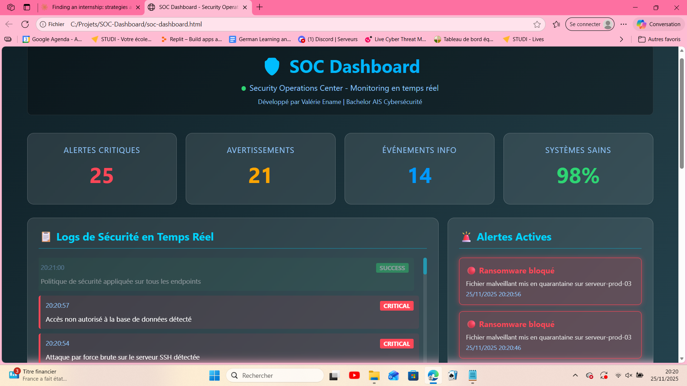
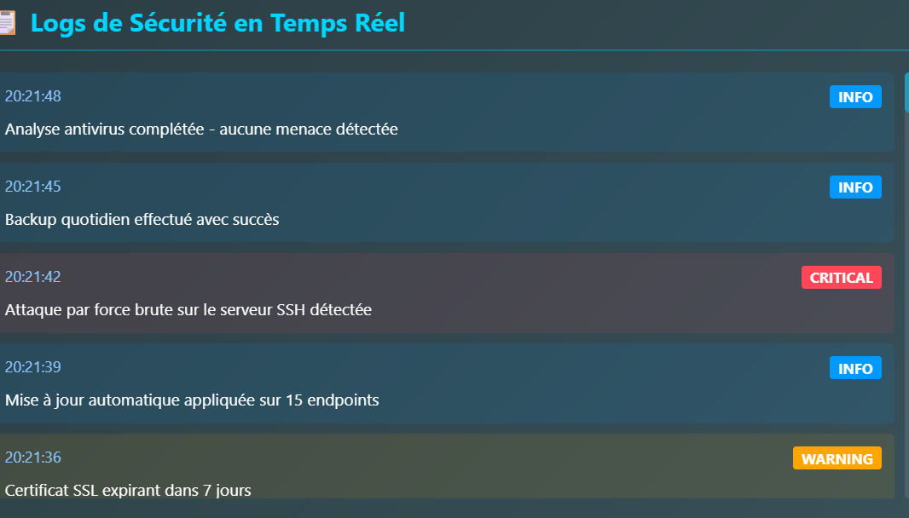
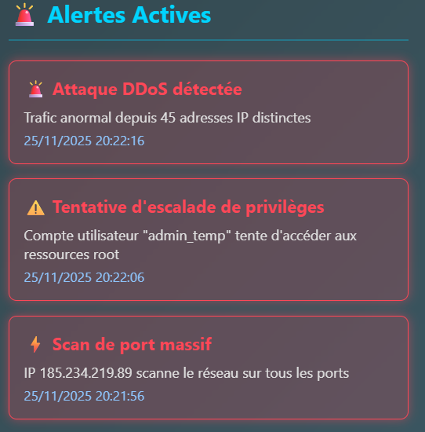

# 🛡️ SOC Dashboard - Security Operations Center

Tableau de bord interactif de supervision de sécurité simulant un centre d'opérations SOC en temps réel.

## 🎯 Fonctionnalités

### Monitoring en Temps Réel
✅ **Logs de sécurité** qui apparaissent automatiquement toutes les 3 secondes  
✅ **Alertes critiques** avec animations et notifications visuelles  
✅ **Statistiques en direct** : alertes critiques, avertissements, événements  
✅ **Top 5 des menaces** détectées avec compteurs  
✅ **Graphique des événements** par période horaire  

### Interface Moderne
✅ Design glassmorphism avec effets de transparence  
✅ Animations fluides et transitions  
✅ Code couleur par niveau de sévérité (Critical, Warning, Info, Success)  
✅ Responsive design (adapté mobile/tablette/desktop)  
✅ Dark mode avec dégradés  

### Simulation Réaliste
✅ Types d'événements variés : intrusions, malware, brute force, DDoS  
✅ Génération aléatoire d'alertes de sécurité  
✅ Horodatage temps réel  
✅ Compteurs automatiques de menaces  

## 📸 Aperçu





## 🚀 Utilisation

### Méthode 1 : Locale
```bash
# Télécharger le fichier
git clone https://github.com/VAL-cyber-pentester/SOC-Dashboard.git

# Ouvrir dans le navigateur
# Double-cliquer sur soc-dashboard.html
```

### Méthode 2 : GitHub Pages (Live Demo)
Accès direct : `https://val-cyber-pentester.github.io/SOC-Dashboard/soc-dashboard.html`

*(Note : Activer GitHub Pages dans Settings → Pages → Source: main branch)*

## 🛠️ Technologies

- **HTML5** : Structure du dashboard
- **CSS3** : Design moderne avec glassmorphism, animations, gradients
- **JavaScript** : Logique de simulation, génération de logs, mise à jour en temps réel

**Aucune bibliothèque externe requise** - 100% vanilla JavaScript !

## 📊 Types d'Événements Simulés

### Critical (Rouge)
- Tentatives d'intrusion
- Attaques par force brute
- Détection de malware/ransomware
- Accès non autorisés

### Warning (Orange)
- Connexions échouées
- Utilisation anormale de ressources
- Certificats expirants
- Politiques de sécurité faibles

### Info (Bleu)
- Scans de vulnérabilités
- Mises à jour appliquées
- Backups réussis

### Success (Vert)
- Systèmes opérationnels
- Sécurité à jour
- Aucune menace détectée

## 🎨 Design

### Palette de couleurs
- Background : Gradient bleu foncé (`#0f2027` → `#2c5364`)
- Accent : Cyan lumineux (`#00d4ff`)
- Critical : Rouge (`#ff4757`)
- Warning : Orange (`#ffa502`)
- Success : Vert (`#2ed573`)

### Effets visuels
- Glassmorphism (arrière-plans flous)
- Animations de slide-in pour les nouveaux logs
- Effet pulse sur les alertes critiques
- Hover effects sur les cartes
- Scrollbar personnalisée

## 🔮 Améliorations Futures

- [ ] Connexion à une vraie source de logs (API SIEM)
- [ ] Filtres par type d'événement et sévérité
- [ ] Export des logs en CSV/JSON
- [ ] Notifications push navigateur
- [ ] Mode clair/sombre toggle
- [ ] Graphiques avancés (Chart.js)
- [ ] Géolocalisation des attaques sur carte
- [ ] Authentification utilisateur
- [ ] Dashboard multi-pages (Overview, Threats, Analytics)

## 🎓 Contexte Projet

Ce projet a été réalisé dans le cadre de ma formation **Bachelor AIS (Administrateur d'Infrastructures Sécurisées)** pour démontrer :
- Compétences en développement web
- Compréhension des opérations SOC
- Visualisation de données de sécurité
- Design moderne et UX

## 📧 Contact

**Valérie Ename**
Bachelor AIS - Cybersécurité
🔗 GitHub
🔗 TryHackMe
📧 valerieenamezolo920@gmail.com
